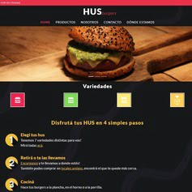

# Sitio web HUS Burgers
Sitio diseñado y desarrollado para HUS Burgers, una empresa dedidaca a la fabricacíon y venta de hamburguesas gourmet y saludables, congeladas.

# Contenido
El sitio web cuenta con 5 páginas. Index es la página de inicio donde se encuentra información en general. Las demás páginas cuentan con información más detallada. También cuenta con una página de error 404 personalizada.
Cada página está estructurada con HTML5, utilizando etiquetas semánticas adecuadas, clases pertinentes y un buen nesting. Se agregaron los alt pertinentes a las imágenes.

Se le dio estilo mediante CSS, donde se utilizó el procesador SASS para compilar el mismo.
Se utilizó una paleta de colores que se definieron mediante variables, y se respeta a lo largo de las páginas del sitio web. Los textos tienen varios niveles de lectura, volviendo dinámica la lectura/escaneo visual del contenido, haciendo hover en link relevantes, con cambios de colores para generar interés. Se utilizaron unidades de medida rem.

Dentro de su estructura se utilizó Bootstrap para darle dinamismo incluyendo JavaScript  a la barra de navegación del header y de la página de productos.
Se utilizó las librerías WOW y Animate.css para darle animación a determinados elementos del index.
El sitio web cuenta con una buena navegación en numerosos tamaños, en particular en mobile, laptop y desktop.  Está diseñado como mobile first y se utilizaron media querys para las distintas resoluciones: 768px, 992px y 1200px.
Se definen meta tags, tamaños de imagen y otros, correspondientes a un buen porcentaje de SEO en todas las páginas.

# Preview

